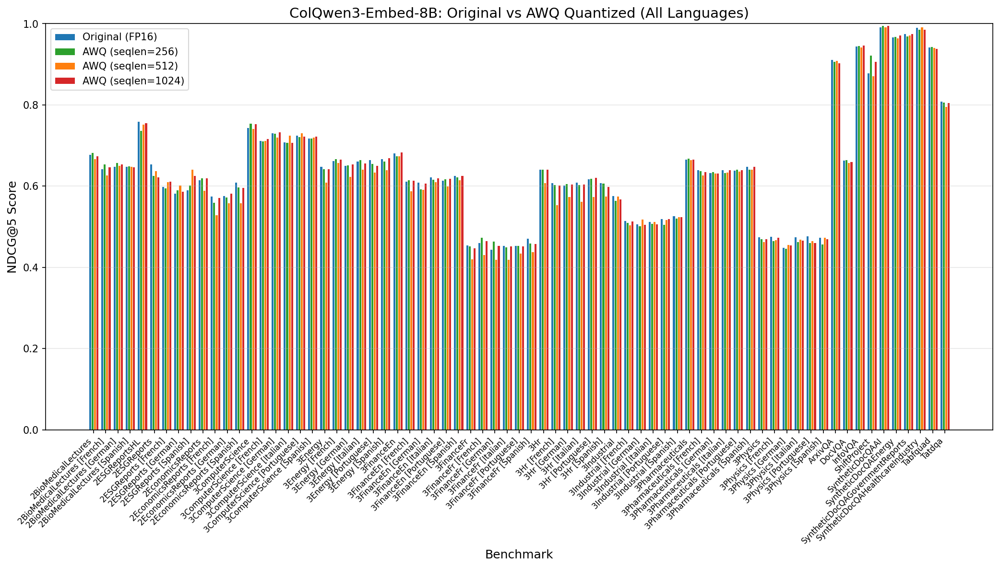
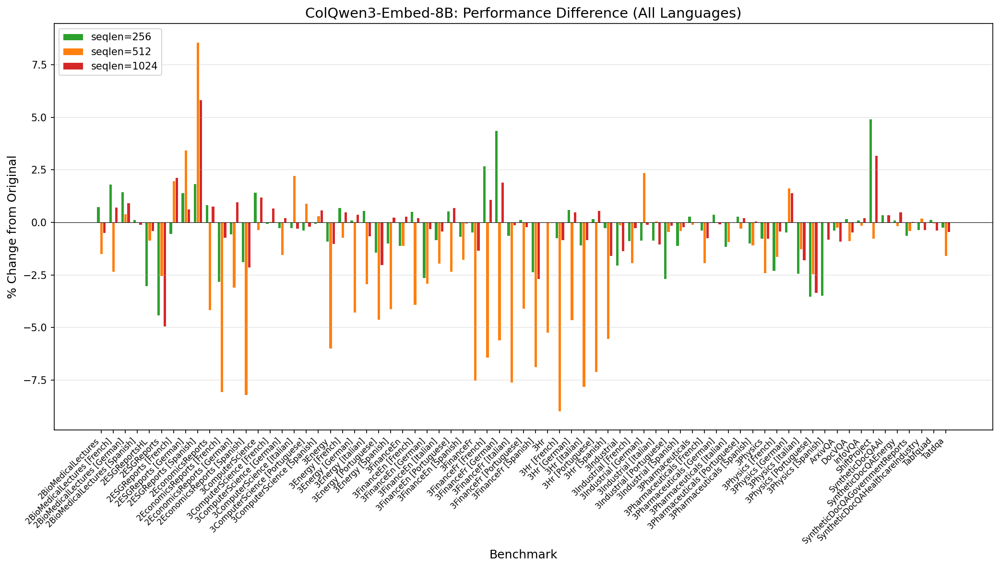
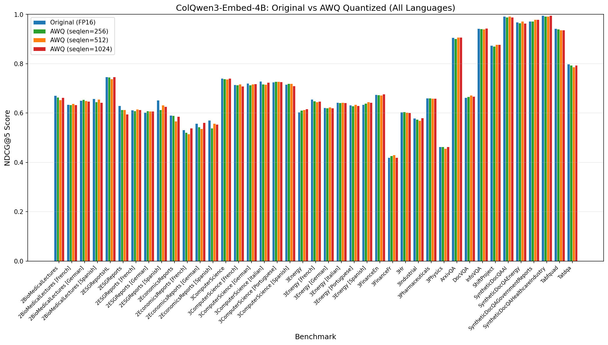
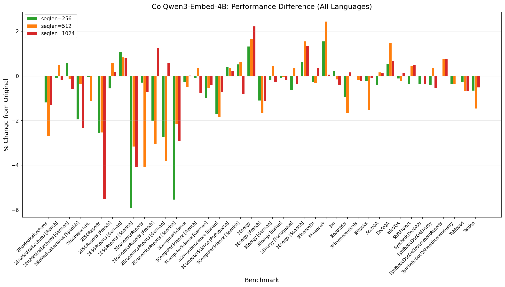
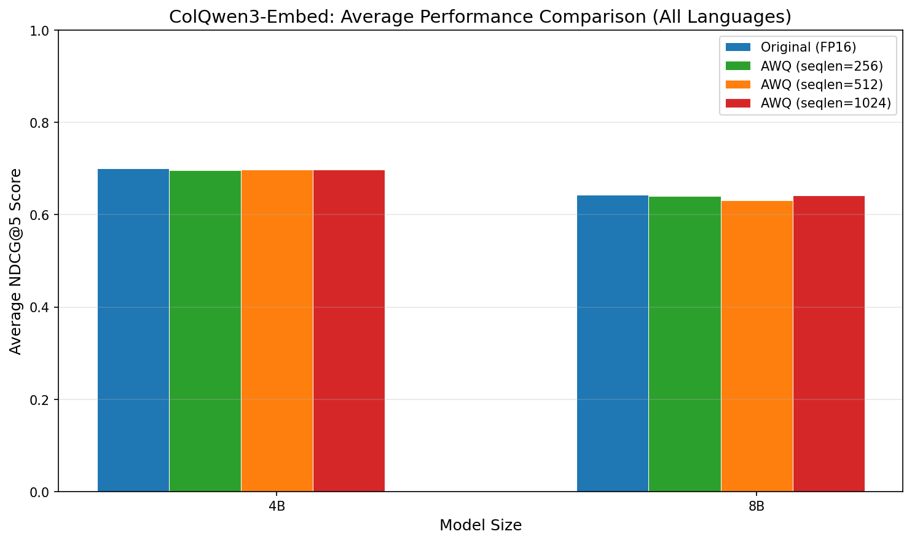

# ColQwen3-Embed Quantization Analysis Report

## Executive Summary

This report analyzes the performance impact of W4A16 quantization on TomoroAI's ColQwen3-Embed models (4B and 8B variants) using AutoRound with AutoAWQ backend. We evaluated three calibration sequence lengths (256, 512, 1024) using the NeelNanda/pile-10k dataset.

### Key Findings

| Model | Best Quantization | Performance Loss | Memory Savings |
|-------|-------------------|------------------|----------------|
| **8B** | seqlen=1024 | -0.08% | 53% (16.7 GB → 7.9 GB) |
| **4B** | seqlen=1024 | -0.36% | 58% (8.4 GB → 3.5 GB) |

**Recommendation: Use `seqlen=1024` for both models.** This configuration achieves near-lossless quantization with minimal performance degradation while providing significant memory savings.

---

## Methodology

### Quantization Configuration

All models were quantized using the following base configuration:

| Parameter | Value |
|-----------|-------|
| **Method** | AutoRound + AutoAWQ |
| **Scheme** | W4A16 (4-bit weights, 16-bit activations) |
| **Bits** | 4 |
| **Group Size** | 128 |
| **Symmetric** | True |
| **Iterations** | 1000 |
| **Calibration Dataset** | NeelNanda/pile-10k |

**Note:** The vision encoder was kept in FP16 (not quantized). Only the language model layers were quantized, which is appropriate since calibration used text-only data.

### Evaluation Benchmarks

Models were evaluated on the MTEB Vidore benchmark suite, measuring **NDCG@5** scores across:
- 22 benchmark tasks
- 6 languages (English, French, German, Spanish, Italian, Portuguese)
- 71 total evaluation entries for 8B model
- 41 total evaluation entries for 4B model

---

## Results

### 8B Model Performance

| Quantization | Avg NDCG@5 (All Lang) | Change | Avg NDCG@5 (English) | Change |
|--------------|----------------------|--------|----------------------|--------|
| Original (FP16) | 0.64247 | - | 0.75798 | - |
| AWQ seqlen=256 | 0.64044 | **-0.32%** | 0.75688 | -0.14% |
| AWQ seqlen=512 | 0.63063 | -1.84% | 0.74782 | -1.34% |
| AWQ seqlen=1024 | 0.64198 | **-0.08%** | 0.75660 | -0.18% |

#### Benchmark-Level Analysis (8B)

| Metric | seqlen=256 | seqlen=512 | seqlen=1024 |
|--------|------------|------------|-------------|
| Improved benchmarks | 28 | 14 | 30 |
| Degraded benchmarks | 43 | 56 | 41 |
| Unchanged | 0 | 1 | 0 |

**Observations:**
- `seqlen=1024` achieves near-lossless performance with only -0.08% average degradation
- `seqlen=512` shows the worst performance, particularly struggling with HR, Finance, and Economics benchmarks
- `seqlen=256` provides a good balance but is slightly worse than 1024

### 4B Model Performance

| Quantization | Avg NDCG@5 (All Lang) | Change | Avg NDCG@5 (English) | Change |
|--------------|----------------------|--------|----------------------|--------|
| Original (FP16) | 0.70023 | - | 0.74648 | - |
| AWQ seqlen=256 | 0.69611 | -0.59% | 0.74105 | -0.73% |
| AWQ seqlen=512 | 0.69696 | -0.47% | 0.74162 | -0.65% |
| AWQ seqlen=1024 | 0.69768 | **-0.36%** | 0.74268 | **-0.51%** |

#### Benchmark-Level Analysis (4B)

| Metric | seqlen=256 | seqlen=512 | seqlen=1024 |
|--------|------------|------------|-------------|
| Improved benchmarks | 10 | 16 | 17 |
| Degraded benchmarks | 30 | 24 | 23 |
| Unchanged | 1 | 1 | 1 |

**Observations:**
- All three sequence lengths perform similarly for the 4B model
- `seqlen=1024` has the best overall performance with -0.36% degradation
- The 4B model shows more consistent behavior across different calibration lengths

---

## Memory Efficiency

| Model | Original Size | Quantized Size | Reduction |
|-------|---------------|----------------|-----------|
| **8B** | 16.7 GB | 7.9 GB | **52.7%** |
| **4B** | 8.4 GB | 3.5 GB | **58.3%** |

The W4A16 quantization provides approximately **2x memory reduction** for both model sizes, enabling deployment on consumer-grade GPUs.

---

## Analysis

### Why seqlen=1024 Performs Best

1. **Better context representation**: Longer calibration sequences capture more diverse linguistic patterns, leading to better weight approximations during quantization.

2. **Alignment with model architecture**: ColQwen3 models support long context (up to 262K tokens). Calibrating with longer sequences better represents the model's intended use case.

3. **Reduced quantization error**: More tokens per sample means the quantization algorithm has more information to minimize reconstruction error.

### Why seqlen=512 Underperforms (8B Model)

The 8B model with seqlen=512 shows notably worse performance (-1.84% vs -0.08% for seqlen=1024). Possible explanations:

1. **Suboptimal batch size**: seqlen=512 used batch_size=150 vs batch_size=50 for seqlen=1024. The larger batch with medium context may have led to averaging effects that hurt precision.

2. **Sweet spot mismatch**: 512 tokens may fall in an awkward middle ground - not short enough for efficient calibration, not long enough for comprehensive context capture.

---

## Recommendations

### Primary Recommendation: seqlen=1024

For production deployments, we recommend the **seqlen=1024** quantized models:

| Model | Recommended Quantized Version | Expected Performance |
|-------|------------------------------|---------------------|
| **8B** | `tomoro-ai-colqwen3-embed-8b-w4a16-autoawq-seqlen-1024` | -0.08% from original |
| **4B** | `tomoro-ai-colqwen3-embed-4b-w4a16-autoawq-seqlen-1024` | -0.36% from original |

### Use Case Guidelines

| Scenario | Recommendation |
|----------|----------------|
| **Maximum accuracy** | Use seqlen=1024 quantized model |
| **Memory-constrained deployment** | seqlen=1024 (same memory as other quantized versions) |
| **Quick experimentation** | seqlen=256 is acceptable (-0.32% for 8B) |
| **Avoid** | seqlen=512 for 8B model (significant degradation) |

### Quantization Recipe

For replicating the best quantization configuration:

```python
# Recommended quantization settings
config = {
    "bits": 4,
    "group_size": 128,
    "sym": True,
    "seqlen": 1024,  # Key parameter
    "iters": 1000,
    "nsamples": 500,
    "calibration_dataset": "NeelNanda/pile-10k",
    "quant_method": "awq",
    "provider": "auto-round"
}
```

---

## Performance Graphs

### 8B Model Comparison




### 4B Model Comparison




### Overall Comparison


---

## Conclusion

W4A16 quantization using AutoRound with AutoAWQ provides an excellent trade-off between model size and performance for ColQwen3-Embed models. With the recommended **seqlen=1024** calibration:

- **8B model**: Achieves near-lossless performance (-0.08%) with 53% memory reduction
- **4B model**: Maintains strong performance (-0.36%) with 58% memory reduction

Both quantized models are suitable for production deployment where memory efficiency is critical, with minimal impact on retrieval quality.

---

*Report generated on 2025-12-15*
