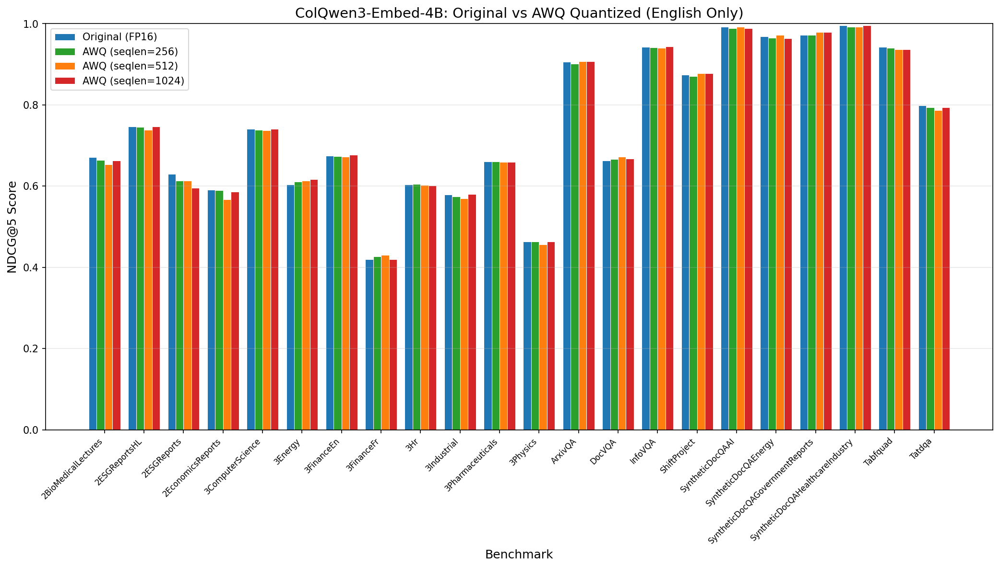
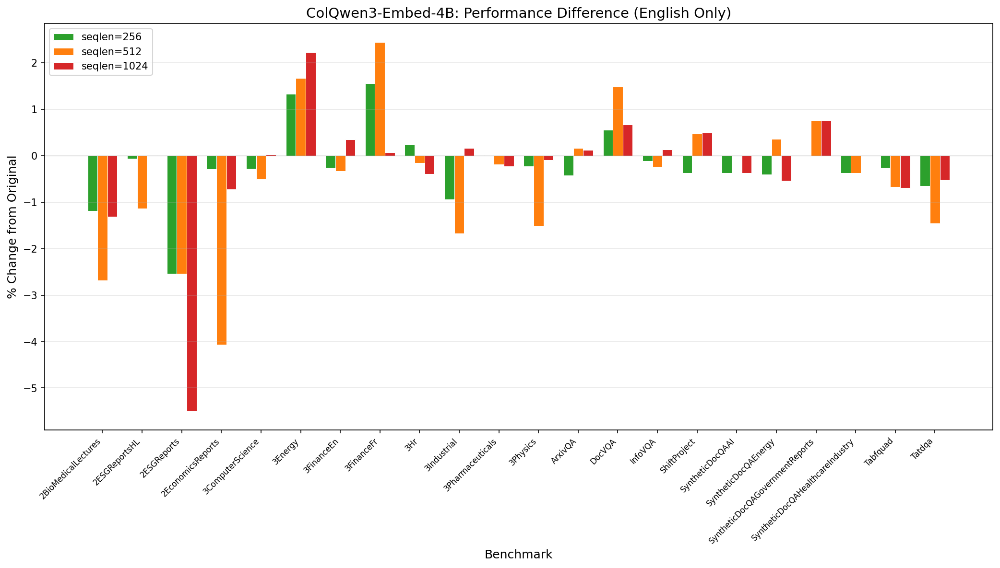

# Model Comparison Report: 4B Original vs AWQ Quantized (English Only)

## Model Information

| Property | Original (FP16) |
|----------|-----------------|
| **Model Name** | TomoroAI/tomoro-colqwen3-embed-4b |
| **Parameters** | 4.0B |
| **Memory Usage** | 8.4 GB |
| **Release Date** | 2025-11-26 |

## Quantization Configuration

All quantized models use **AutoRound with AutoAWQ** backend, calibrated with **NeelNanda/pile-10k** dataset.

| Property | seqlen=256 | seqlen=512 | seqlen=1024 |
|----------|------------|------------|-------------|
| **bits** | 4 | 4 | 4 |
| **group_size** | 128 | 128 | 128 |
| **sym** | True | True | True |
| **iters** | 1000 | 1000 | 1000 |
| **nsamples** | 300 | 600 | 560 |
| **batch_size** | 300 | 200 | 80 |
| **quant_method** | awq | auto-round | auto-round |
| **provider** | auto-round | N/A | N/A |

**Quantized Memory Usage:** ~3.5 GB

## NDCG@5 Performance Comparison

| Benchmark | Original | seqlen=256 | Δ% | seqlen=512 | Δ% | seqlen=1024 | Δ% |
|-----------|----------|------------|-----|------------|-----|------------|-----|
| Vidore2BioMedicalLecturesRetrieval [English] | 0.67177 | 0.66380 | -1.19% | 0.65376 | -2.68% | 0.66300 | -1.31% |
| Vidore2ESGReportsHLRetrieval [English] | 0.74647 | 0.74601 | -0.06% | 0.73799 | -1.14% | 0.74659 | +0.02% |
| Vidore2ESGReportsRetrieval [English] | 0.62995 | 0.61395 | -2.54% | 0.61398 | -2.54% | 0.59529 | -5.50% |
| Vidore2EconomicsReportsRetrieval [English] | 0.59102 | 0.58929 | -0.29% | 0.56702 | -4.06% | 0.58675 | -0.72% |
| Vidore3ComputerScienceRetrieval [English] | 0.74080 | 0.73873 | -0.28% | 0.73706 | -0.50% | 0.74100 | +0.03% |
| Vidore3EnergyRetrieval [English] | 0.60348 | 0.61152 | +1.33% | 0.61355 | +1.67% | 0.61693 | +2.23% |
| Vidore3FinanceEnRetrieval [English] | 0.67494 | 0.67323 | -0.25% | 0.67275 | -0.32% | 0.67734 | +0.36% |
| Vidore3FinanceFrRetrieval [English] | 0.42003 | 0.42656 | +1.55% | 0.43031 | +2.45% | 0.42032 | +0.07% |
| Vidore3HrRetrieval [English] | 0.60373 | 0.60522 | +0.25% | 0.60278 | -0.16% | 0.60136 | -0.39% |
| Vidore3IndustrialRetrieval [English] | 0.57932 | 0.57386 | -0.94% | 0.56961 | -1.68% | 0.58028 | +0.17% |
| Vidore3PharmaceuticalsRetrieval [English] | 0.66048 | 0.66057 | +0.01% | 0.65923 | -0.19% | 0.65902 | -0.22% |
| Vidore3PhysicsRetrieval [English] | 0.46403 | 0.46300 | -0.22% | 0.45698 | -1.52% | 0.46362 | -0.09% |
| VidoreArxivQARetrieval [English] | 0.90576 | 0.90194 | -0.42% | 0.90728 | +0.17% | 0.90693 | +0.13% |
| VidoreDocVQARetrieval [English] | 0.66296 | 0.66667 | +0.56% | 0.67285 | +1.49% | 0.66742 | +0.67% |
| VidoreInfoVQARetrieval [English] | 0.94312 | 0.94207 | -0.11% | 0.94088 | -0.24% | 0.94444 | +0.14% |
| VidoreShiftProjectRetrieval [English] | 0.87389 | 0.87063 | -0.37% | 0.87802 | +0.47% | 0.87819 | +0.49% |
| VidoreSyntheticDocQAAIRetrieval [English] | 0.99262 | 0.98893 | -0.37% | 0.99262 | 0.00% | 0.98893 | -0.37% |
| VidoreSyntheticDocQAEnergyRetrieval [English] | 0.96911 | 0.96524 | -0.40% | 0.97262 | +0.36% | 0.96393 | -0.53% |
| VidoreSyntheticDocQAGovernmentReportsRetrieval [English] | 0.97172 | 0.97172 | 0.00% | 0.97911 | +0.76% | 0.97911 | +0.76% |
| VidoreSyntheticDocQAHealthcareIndustryRetrieval [English] | 0.99631 | 0.99262 | -0.37% | 0.99262 | -0.37% | 0.99631 | 0.00% |
| VidoreTabfquadRetrieval [English] | 0.94329 | 0.94087 | -0.26% | 0.93698 | -0.67% | 0.93681 | -0.69% |
| VidoreTatdqaRetrieval [English] | 0.79867 | 0.79347 | -0.65% | 0.78702 | -1.46% | 0.79457 | -0.51% |
|-----------|----------|------------|-----|------------|-----|------------|-----|
| **Average** | **0.74743** | **0.74545** | **-0.26%** | **0.74432** | **-0.42%** | **0.74582** | **-0.21%** |

## Summary

- **Benchmark files (Original):** 22
- **Total entries evaluated:** 22

### Performance by Calibration Sequence Length

| Metric | seqlen=256 | seqlen=512 | seqlen=1024 |
|--------|------------|------------|-------------|
| **Improved** | 5 | 7 | 11 |
| **Degraded** | 16 | 14 | 10 |
| **Unchanged** | 1 | 1 | 1 |

### Overall Scores

| Model | Average NDCG@5 | Change from Original |
|-------|----------------|----------------------|
| Original (FP16) | 0.74743 | - |
| AWQ (seqlen=256) | 0.74545 | -0.26% |
| AWQ (seqlen=512) | 0.74432 | -0.42% |
| AWQ (seqlen=1024) | 0.74582 | -0.21% |

## Performance Graphs

