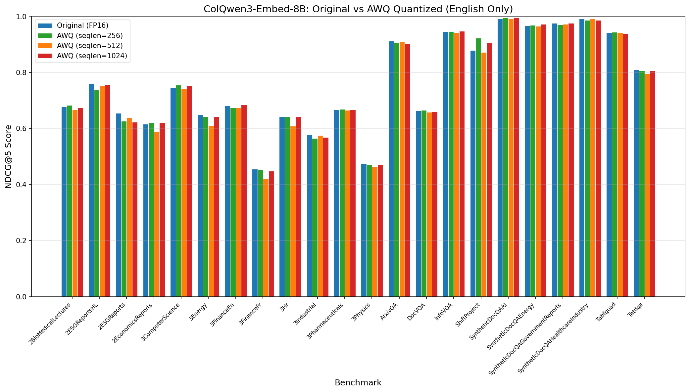
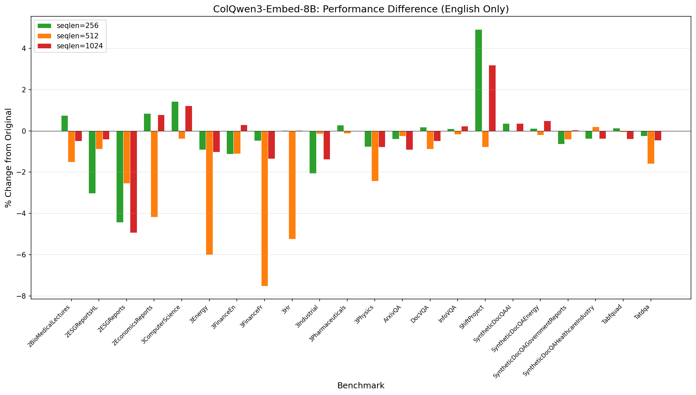

# Model Comparison Report: 8B Original vs AWQ Quantized (English Only)

## Model Information

| Property | Original (FP16) |
|----------|-----------------|
| **Model Name** | TomoroAI/tomoro-colqwen3-embed-8b |
| **Parameters** | 8.0B |
| **Memory Usage** | 16.7 GB |
| **Release Date** | 2025-11-26 |

## Quantization Configuration

All quantized models use **AutoRound with AutoAWQ** backend, calibrated with **NeelNanda/pile-10k** dataset.

| Property | seqlen=256 | seqlen=512 | seqlen=1024 |
|----------|------------|------------|-------------|
| **bits** | 4 | 4 | 4 |
| **group_size** | 128 | 128 | 128 |
| **sym** | True | True | True |
| **iters** | 1000 | 1000 | 1000 |
| **nsamples** | 300 | 300 | 500 |
| **batch_size** | 300 | 150 | 50 |
| **quant_method** | awq | awq | awq |
| **provider** | auto-round | auto-round | auto-round |

**Quantized Memory Usage:** ~7.9 GB

## NDCG@5 Performance Comparison

| Benchmark | Original | seqlen=256 | Δ% | seqlen=512 | Δ% | seqlen=1024 | Δ% |
|-----------|----------|------------|-----|------------|-----|------------|-----|
| Vidore2BioMedicalLecturesRetrieval [English] | 0.67838 | 0.68345 | +0.75% | 0.66814 | -1.51% | 0.67505 | -0.49% |
| Vidore2ESGReportsHLRetrieval [English] | 0.75981 | 0.73684 | -3.02% | 0.75315 | -0.88% | 0.75673 | -0.41% |
| Vidore2ESGReportsRetrieval [English] | 0.65488 | 0.62584 | -4.43% | 0.63820 | -2.55% | 0.62255 | -4.94% |
| Vidore2EconomicsReportsRetrieval [English] | 0.61587 | 0.62106 | +0.84% | 0.59014 | -4.18% | 0.62067 | +0.78% |
| Vidore3ComputerScienceRetrieval [English] | 0.74431 | 0.75495 | +1.43% | 0.74155 | -0.37% | 0.75338 | +1.22% |
| Vidore3EnergyRetrieval [English] | 0.64907 | 0.64319 | -0.91% | 0.61018 | -5.99% | 0.64242 | -1.02% |
| Vidore3FinanceEnRetrieval [English] | 0.68226 | 0.67461 | -1.12% | 0.67471 | -1.11% | 0.68427 | +0.29% |
| Vidore3FinanceFrRetrieval [English] | 0.45463 | 0.45244 | -0.48% | 0.42045 | -7.52% | 0.44853 | -1.34% |
| Vidore3HrRetrieval [English] | 0.64208 | 0.64230 | +0.03% | 0.60840 | -5.25% | 0.64230 | +0.03% |
| Vidore3IndustrialRetrieval [English] | 0.57657 | 0.56474 | -2.05% | 0.57577 | -0.14% | 0.56862 | -1.38% |
| Vidore3PharmaceuticalsRetrieval [English] | 0.66648 | 0.66843 | +0.29% | 0.66572 | -0.11% | 0.66646 | -0.00% |
| Vidore3PhysicsRetrieval [English] | 0.47473 | 0.47110 | -0.76% | 0.46322 | -2.42% | 0.47101 | -0.78% |
| VidoreArxivQARetrieval [English] | 0.91151 | 0.90789 | -0.40% | 0.90922 | -0.25% | 0.90320 | -0.91% |
| VidoreDocVQARetrieval [English] | 0.66369 | 0.66496 | +0.19% | 0.65785 | -0.88% | 0.66049 | -0.48% |
| VidoreInfoVQARetrieval [English] | 0.94478 | 0.94577 | +0.10% | 0.94317 | -0.17% | 0.94699 | +0.23% |
| VidoreShiftProjectRetrieval [English] | 0.87889 | 0.92214 | +4.92% | 0.87202 | -0.78% | 0.90702 | +3.20% |
| VidoreSyntheticDocQAAIRetrieval [English] | 0.99262 | 0.99631 | +0.37% | 0.99262 | 0.00% | 0.99631 | +0.37% |
| VidoreSyntheticDocQAEnergyRetrieval [English] | 0.96710 | 0.96823 | +0.12% | 0.96524 | -0.19% | 0.97193 | +0.50% |
| VidoreSyntheticDocQAGovernmentReportsRetrieval [English] | 0.97579 | 0.96954 | -0.64% | 0.97172 | -0.42% | 0.97623 | +0.05% |
| VidoreSyntheticDocQAHealthcareIndustryRetrieval [English] | 0.99062 | 0.98693 | -0.37% | 0.99262 | +0.20% | 0.98693 | -0.37% |
| VidoreTabfquadRetrieval [English] | 0.94231 | 0.94361 | +0.14% | 0.94179 | -0.06% | 0.93863 | -0.39% |
| VidoreTatdqaRetrieval [English] | 0.80918 | 0.80714 | -0.25% | 0.79627 | -1.60% | 0.80553 | -0.45% |
|-----------|----------|------------|-----|------------|-----|------------|-----|
| **Average** | **0.75798** | **0.75688** | **-0.14%** | **0.74782** | **-1.34%** | **0.75660** | **-0.18%** |

## Summary

- **Benchmark files (Original):** 22
- **Total entries evaluated:** 22

### Performance by Calibration Sequence Length

| Metric | seqlen=256 | seqlen=512 | seqlen=1024 |
|--------|------------|------------|-------------|
| **Improved** | 11 | 1 | 9 |
| **Degraded** | 11 | 20 | 13 |
| **Unchanged** | 0 | 1 | 0 |

### Overall Scores

| Model | Average NDCG@5 | Change from Original |
|-------|----------------|----------------------|
| Original (FP16) | 0.75798 | - |
| AWQ (seqlen=256) | 0.75688 | -0.14% |
| AWQ (seqlen=512) | 0.74782 | -1.34% |
| AWQ (seqlen=1024) | 0.75660 | -0.18% |

## Performance Graphs

